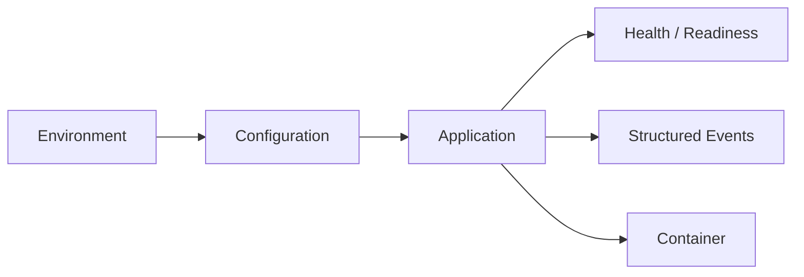

# Infrastructure Patterns

**Public Reference Implementation — No Proprietary IP**

A local-first reference implementation of practical infrastructure patterns for production-oriented Python services.

## Architecture

`Configuration → Application Boundary → Health/Readiness → Structured Events → Container`

## Demonstrated patterns

- environment-driven configuration
- health and readiness contracts
- structured operational events
- container boundaries
- local execution with no external service dependency
- testable operational behavior

## Scope

This repository is independent technical evidence. It contains no proprietary production configuration, credentials, private deployment details, or cloud dependency. It is intentionally small enough to run locally and in CI.

## Run

`python -m pytest -q`

## Architecture

